# AI-Powered Fraud & Risk Analysis Engine (GCP Production-Ready RAG)

*Note: This repository is a sanitized, production-grade reference architecture demonstrating enterprise coding standards, GCP AI pipelines, and MLOps patterns.*

## Business Impact
Increased fraudulent claim identification accuracy by 35%, reduced agent review time by 50%, and significantly reduced financial losses for a Tier-1 financial services client.

## Architecture Flow

```mermaid
    graph TD
    %% Offline Pipeline
    subgraph Offline Ingestion Pipeline [Golden Dataset Creation]
        A[(Raw Unstructured Claims\nData Lake)] --> B[Pandas / Python Loader]
        B --> C{Regex PII Sanitization}
        C --> D[LangChain Text Splitter]
        D --> E[Embedding Generation\ntext-embedding-004]
        E --> F[(Google Cloud Storage\n--> Vertex AI Vector Search)]
    end

    %% Online API
    subgraph Online RAG API [Real-Time Inference]
        G[Agent / Operations UI] -->|POST /analyze-claim| H(FastAPI Application on Cloud Run)
        H --> I{Similarity Search}
        I -->|Query| F
        F -->|Top-K Historical Frauds| I
        I --> J[LangChain Strict Prompt Template]
        J --> K[Google Gemini 1.5 Pro]
        K --> L[Pydantic JSON Parser]
        L -->|Structured Risk Score| G
    end
    
    classDef GCP fill:#263238,stroke:#4285f4,stroke-width:2px;
    class F,K GCP;
```



## Enterprise Governance & MLOps
Designed strictly for Tier-1 financial compliance and Responsible AI principles:

- **Data Security**: Strict Regex-based offline preprocessing to sanitize and strip Personally Identifiable Information (PII) before generating embedding vectors or storing contexts.
- **Hallucination Prevention (Grounding)**: Online LLM outputs are forced into predictable JSON structures via LangChain and strictly validated using Pydantic schemas. The model is prompted to explicitly cite chunks from Vertex AI Vector Search.
- **Infrastructure as Code (IaC)**: GCP resources (Vertex Search endpoints, GCS Buckets, Artifact Registry, secure Service Accounts) are provisioned and managed declaratively via Terraform.

## Stack Summary
- **Backend Framework**: FastAPI (Strict typing, async, OpenAPI compatible)
- **Generative AI Engine**: Google Vertex AI (Gemini 1.5 Pro) via LangChain
- **Vector Search / RAG**: Vertex AI Vector Search (Using `text-embedding-004` embeddings) with fallback configurations
- **Data Validation & Config**: Pydantic v2 BaseSettings
- **Cloud Infrastructure**: Google Cloud Storage, Artifact Registry, and Google Cloud Run
- **IaC & Automation**: Terraform (>= 1.3.0)

## Production Deployment & Operational Setup

### 1. Provision Infrastructure with Terraform
Navigate to the `infrastructure/` directory to deploy secure GCP services:
```bash
cd infrastructure
terraform init
terraform apply \
  -var="project_id=YOUR_GCP_PROJECT_ID" \
  -var="gcs_bucket_name=YOUR_UNIQUE_GCS_BUCKET_NAME" \
  -var="vertex_index_id=YOUR_VERTEX_INDEX_ID" \
  -var="vertex_endpoint_id=YOUR_VERTEX_ENDPOINT_ID"
```

### 2. Configure Environment Variables
Create a `.env` file in the root of the `RO-Fraud` folder:
```env
GCP_PROJECT_ID=your-gcp-project-id
GCP_REGION=us-central1
GCS_BUCKET_NAME=your-gcs-bucket-name
VERTEX_INDEX_ID=your-vertex-index-id
VERTEX_ENDPOINT_ID=your-vertex-endpoint-id
```

### 3. Run Ingestion Pipeline
The ingestion pipeline cleanses raw claims (via Regex), generates dense vectors using `text-embedding-004`, and uploads the canonical JSONL payload directly to GCS for Indexing:
```bash
python pipeline/build_vector_index.py
```
*(Note: Creating or rebuilding a Vertex AI Vector Search Index from GCS and deploying it to an endpoint takes approximately 45 minutes).*

---

## Local Setup & Development

1. Install production requirements:
   ```bash
   pip install -r requirements.txt
   ```
2. Authenticate standard Google Application Default Credentials (ADC):
   ```bash
   gcloud auth application-default login
   ```
3. Start the API locally:
   ```bash
   uvicorn api.main:app --reload
   ```
4. Build and run using Docker:
   ```bash
   docker build -t ro-fraud-api .
   docker run -p 8080:8080 \
     --env-file .env \
     -v ~/.config/gcloud:/root/.config/gcloud \
     ro-fraud-api
   ```
