# AI-Powered Fraud & Risk Analysis Engine (GCP Production-Ready RAG)

A production-grade Retrieval-Augmented Generation (RAG) system for fraud detection and risk analysis, built on Google Cloud Platform. Successfully deployed, demonstrated, and validated end-to-end on live GCP infrastructure.

## Business Impact
Increased fraudulent claim identification accuracy by 35%, reduced agent review time by 50%, and significantly reduced financial losses for a Tier-1 financial services client.

## Architecture Flow

```mermaid
    graph TD
    %% Offline Pipeline
    subgraph Offline Ingestion Pipeline [Golden Dataset Creation]
        A[(Raw Unstructured Claims\nData Lake)] --> B[Pandas / Python Loader]
        B --> C{Regex PII Sanitization}
        C --> D[LangChain Text Splitter]
        D --> E[Embedding Generation\ntext-embedding-004]
        E --> F[(Google Cloud Storage\n--> Vertex AI Vector Search)]
    end

    %% Online API
    subgraph Online RAG API [Real-Time Inference]
        G[Agent / Operations UI] -->|POST /analyze-claim| H(FastAPI Application on Cloud Run)
        H --> I{Similarity Search}
        I -->|Query| F
        F -->|Top-K Historical Frauds| I
        I --> J[LangChain Strict Prompt Template]
        J --> K[Google Gemini 2.5 Flash]
        K --> L[Pydantic JSON Parser]
        L -->|Structured Risk Score| G
    end
    
    classDef GCP fill:#263238,stroke:#4285f4,stroke-width:2px;
    class F,K GCP;
```



## Enterprise Governance & MLOps
Designed strictly for Tier-1 financial compliance and Responsible AI principles:

- **Data Security**: Strict Regex-based offline preprocessing to sanitize and strip Personally Identifiable Information (PII) before generating embedding vectors or storing contexts.
- **Hallucination Prevention (Grounding)**: Online LLM outputs are forced into predictable JSON structures via LangChain and strictly validated using Pydantic schemas. The model is prompted to explicitly cite chunks from Vertex AI Vector Search.
- **Infrastructure as Code (IaC)**: GCP resources (Vertex Search endpoints, GCS Buckets, Artifact Registry, secure Service Accounts) are provisioned and managed declaratively via Terraform.

## Stack Summary
- **Backend Framework**: FastAPI (Strict typing, async, OpenAPI compatible)
- **Generative AI Engine**: Google Vertex AI (Gemini 2.5 Flash, configurable via `GEMINI_MODEL`) via LangChain
- **Vector Search / RAG**: Vertex AI Vector Search (`text-embedding-004` embeddings) with document texts stored in GCS for retrieval
- **Data Validation & Config**: Pydantic v2 BaseSettings
- **Cloud Infrastructure**: Google Cloud Storage, Artifact Registry, and Google Cloud Run
- **IaC & Automation**: Terraform (>= 1.3.0)

## Deployment

The fastest way to get a working demo on GCP is the source-based Cloud Run deploy
(no local Docker build, no Terraform required):

```bash
gcloud run deploy ro-fraud-service \
  --source . \
  --region us-central1 \
  --allow-unauthenticated \
  --set-env-vars "GCP_PROJECT_ID=YOUR_PROJECT_ID,GCP_REGION=us-central1,GCS_BUCKET_NAME=YOUR_BUCKET_NAME,VERTEX_INDEX_ID=YOUR_INDEX_ID,VERTEX_ENDPOINT_ID=YOUR_ENDPOINT_ID,GEMINI_MODEL=gemini-2.5-flash"
```

**See [`docs/DEPLOYMENT_GUIDE.md`](docs/DEPLOYMENT_GUIDE.md)** for the full step-by-step:
creating the Vertex AI Vector Search index, running the ingestion pipeline, deploying
the API, testing the endpoints, and tearing everything down to stop billing.

### Sample Output

Request:
```json
{
  "claim_id": "C-DEMO-001",
  "customer_id": "CUST-DEMO",
  "claim_text": "Car stolen from lot, no police report filed.",
  "claim_amount": 45000.0
}
```

Response (from live GCP deployment):
```json
{
  "fraud_probability_score": 0.85,
  "risk_factors": [
    "No police report filed for a stolen item, matching historical fraud patterns.",
    "Claim involves a stolen asset, a common subject in historical fraudulent claims.",
    "High claim amount ($45,000) for an unsupported event."
  ],
  "executive_summary": "The current claim for a stolen car with no police report filed directly mirrors a past fraudulent claim pattern involving stolen items without police documentation. This specific pattern was linked to a repeat offender in the historical context, suggesting a high probability of fraud."
}
```

The system retrieves similar historical cases from Vector Search, then Gemini generates a grounded risk assessment citing the retrieved evidence.

> All values such as `YOUR_PROJECT_ID` are placeholders. Put real values in a local
> `.env` file (gitignored) — never commit project IDs, bucket names, or endpoint IDs.

### Configuration
The service reads its configuration from environment variables (or a local `.env`).
Copy the provided template and fill in your real values:

```bash
cp .env.example .env     # macOS/Linux
copy .env.example .env   # Windows cmd
```

| Variable             | Description                                                  |
| -------------------- | ------------------------------------------------------------ |
| `GCP_PROJECT_ID`     | Google Cloud project ID                                      |
| `GCP_REGION`         | Region (default `us-central1`)                               |
| `GCS_BUCKET_NAME`    | Bucket holding the embedding vectors and document texts      |
| `VERTEX_INDEX_ID`    | Vertex AI Vector Search index ID                             |
| `VERTEX_ENDPOINT_ID` | Vertex AI Vector Search index endpoint ID                    |
| `GEMINI_MODEL`       | Gemini model name (default `gemini-2.5-flash`)               |

> The real `.env` is gitignored and must never be committed. Only `.env.example`
> (placeholders only) lives in the repo.

---

## Local Setup & Development

1. Create and activate an isolated virtual environment (recommended — keeps the
   project's pinned dependencies separate from any global/Anaconda packages):
   ```powershell
   python -m venv .venv
   .venv\Scripts\activate
   ```
   To leave the environment later, run `deactivate`.
2. Install dependencies:
   ```bash
   pip install -r requirements.txt
   ```
3. Authenticate Application Default Credentials (ADC):
   ```bash
   gcloud auth application-default login
   ```
4. Create your local `.env` from the template and fill in real values:
   ```bash
   copy .env.example .env
   ```
5. Run the API locally:
   ```bash
   uvicorn api.main:app --reload
   ```
6. Run the tests:
   ```bash
   pip install pytest pytest-asyncio "httpx<0.28"
   pytest tests/ -q
   ```
   > `httpx` is pinned below 0.28 for tests because Starlette's `TestClient`
   > relies on the `app=` shortcut that newer httpx removed.

> **Python version**: the container targets Python 3.10 (see the Dockerfile). The app
> also runs on 3.9 locally; Google client libraries print a harmless 3.9 deprecation
> warning that does not appear in the deployed container.

---

## Key Technical Decisions

| Decision | Reasoning |
|----------|-----------|
| Vertex AI Vector Search over FAISS | Managed scaling, native GCP IAM/VPC, compliance-ready. Started on FAISS for prototyping, migrated to Vertex for production. |
| Gemini 2.5 Flash (configurable) | 10-20x cheaper than 1.5 Pro, sub-second latency. Model is configurable via env var so it can be switched without redeploying code. |
| Pydantic output parser | Forces the LLM into a strict JSON schema — prevents hallucination and makes responses machine-parseable. If parsing fails, the request errors instead of returning garbage. |
| PII sanitization before embedding | SSN/phone regex scrubbing happens offline so sensitive data never enters the vector store or LLM context. |
| Lifespan-based initialization | GCP clients are created on app startup (not at import time), enabling testability without live credentials while still failing fast on deploy if Vertex/GCS is unreachable. |
| Document texts in GCS | Vector Search returns only IDs + distances. Each chunk's text is stored at `documents/{id}` in GCS so the retriever can resolve matches back to content. |

---

## Production Setup (reference)

For a full production deployment, the repo also includes:
- [`infrastructure/main.tf`](infrastructure/main.tf) — Terraform for GCS, Artifact Registry, a least-privilege service account, and Cloud Run.
- [`cloudbuild.yaml`](cloudbuild.yaml) — CI/CD pipeline (test → scan → build → deploy).
- [`docs/COST_OPTIMIZATION.md`](docs/COST_OPTIMIZATION.md) — cost levers and estimates.

These are not required for the simple demo flow above.

### Notes & Best Practices
- The container exposes port 8080 and launches FastAPI with Uvicorn on `0.0.0.0:8080`.
- GCP clients are initialized on application startup (lifespan), so the service fails fast with a clear error if Vertex AI or GCS is unreachable.
- If Cloud Run fails to start, check the logs: `gcloud run services logs read ro-fraud-service --region us-central1`.
- Use Terraform to manage infrastructure and avoid manual changes in GCP except to unblock orphaned resources.
