# AI-Powered Fraud & Risk Analysis Engine (RAG)

*Note: This repository is a sanitized reference architecture intended to demonstrate enterprise coding standards, GCP data pipelines, and MLOps patterns.*

## Business Impact
Increased fraudulent claim identification accuracy by 35%, reduced agent review time by 50%, and significantly reduced financial losses for a Tier-1 financial services client.

## Architecture Flow

```mermaid
    graph TD
    %% Offline Pipeline
    subgraph Offline Ingestion Pipeline [Golden Dataset Creation]
        A[(Raw Unstructured Claims\nData Lake)] --> B[Pandas / Python Loader]
        B --> C{Regex PII Sanitization}
        C --> D[LangChain Text Splitter]
        D --> E[Embedding Generation]
        E --> F[(Vertex AI Vector Search\nFraud Knowledge Base)]
    end

    %% Online API
    subgraph Online RAG API [Real-Time Inference]
        G[Agent / Operations UI] -->|POST /analyze-claim| H(FastAPI Application)
        H --> I{Similarity Search}
        I -->|Query| F
        F -->|Top-K Historical Frauds| I
        I --> J[LangChain Strict Prompt Template]
        J --> K[Google Gemini Pro]
        K --> L[Pydantic JSON Parser]
        L -->|Structured Risk Score| G
    end
    
    classDef GCP fill:#263238,stroke:#4285f4,stroke-width:2px;
    class F,K GCP;
```



## Enterprise Governance & MLOps
Designed strictly for Tier-1 financial compliance and Responsible AI principles:

- Data Security: Strict Regex-based offline preprocessing to sanitize and strip Personally Identifiable Information (PII) before cloud embedding.
- Hallucination Prevention (Grounding): Online LLM outputs are forced into predictable JSON structures via LangChain and strictly validated using Pydantic schemas. The model is prompted to explicitly cite chunks from the Vector DB.
- Infrastructure as Code (IaC): In production, GCP resources (Vertex endpoints, Cloud Run) are provisioned and managed via Terraform.

## Stack Summary
- Backend Framework: FastAPI (Strict typing, async, OpenAPI compatible)
- Generative AI Engine: Google Vertex AI (Gemini Pro) via LangChain
- Vector Search / RAG: FAISS (Note: Used locally here to mock Vertex AI Matching Engine / Vector Search for scalable GCP production deployment)
- Data Validation: Pydantic
- Containerization & Deployment: Docker, Cloud Run

## Local Setup

1. Install requirements:
   ```bash
   pip install -r requirements.txt
   ```
2. Start the API locally:
   ```bash
   uvicorn api.main:app --reload
   ```
3. Alternatively, build and run using Docker:
   ```bash
   docker build -t ro-fraud-api .
   docker run -p 8080:8080 ro-fraud-api
   ```
