# AI-Powered Fraud & Risk Analysis Engine (RAG)

*Note: This repository is a sanitized reference architecture intended to demonstrate enterprise coding standards and architecture patterns.*

## Business Impact
Increased fraudulent claim identification accuracy by 35%, reduced agent review time by 50%, and significantly reduced financial losses.

## Architecture Flow

```mermaid
graph TD
    subgraph Offline Data Pipeline
        O1[(Raw Historical Claims Data)] -->|Pandas| O2[Regex PII Sanitization]
        O2 -->|RecursiveCharSplitter| O3[Text Chunking]
        O3 -->|VertexAIEmbeddings| O4[Generate Embeddings]
        O4 --> O5[(Golden Dataset: Vector DB)]
    end

    subgraph Online RAG API
        A[Customer Claim Payload\nJSON] -->|POST Request| B(FastAPI Endpoint)
        B --> C{Fraud Pattern Retriever}
        C -->|Embed text| D[(Vertex AI Vector Search\ / FAISS)]
        O5 -.->|Powers| D
        D -->|Top-K Similar Claims| C
        C --> E[Risk Analyzer Module]
        E -->|Inject Context & Claim| F(LangChain Prompt Template)
        F -->|Strict JSON Instructions| G[Google Gemini Pro]
        G -->|Extract Risk Factors| H[Pydantic Output Parser]
        H --> I[Risk Summary Response\nScore & Factors]
        I -->|Return to Agent UI| J[Operations Dashboard]
    end
    
    classDef GCP fill:#263238,stroke:#4285f4,stroke-width:2px;
    class D,G,O4 GCP;
```


## Stack Summary
- **Backend Framework**: FastAPI (Strict typing, async, OpenAPI compatible)
- **Generative AI Engine**: Google Vertex AI (Gemini Pro) via LangChain
- **Vector Search / RAG**: FAISS (Local mock replacing Vertex AI Vector Search)
- **Data Validation**: Pydantic

## Local Setup

1. Install requirements:
   ```bash
   pip install -r requirements.txt
   ```
2. Start the API locally:
   ```bash
   uvicorn api.main:app --reload
   ```
3. Alternatively, build and run using Docker:
   ```bash
   docker build -t ro-fraud-api .
   docker run -p 8080:8080 ro-fraud-api
   ```
