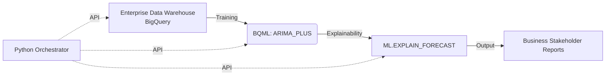

# Predictive Forecasting & Anomaly Detection (BigQuery ML)

**Business Impact:** Led to a 15% improvement in inventory accuracy and an estimated $2M reduction in annual holding costs.

This repository demonstrates predictive analytics and time-series forecasting using Google Cloud BigQuery ML (BQML) and Python. By building an ML pipeline entirely within the Data Warehouse, we achieve infinite scalability and zero-infrastructure MLOps.

## Architecture



## Setup & Execution

1. Install dependencies:
   ```bash
   pip install -r requirements.txt
   ```
2. Ensure you have authenticated with Google Cloud and set your `GOOGLE_APPLICATION_CREDENTIALS` environment variable.
3. Use the Python Orchestrator (`src/bq_orchestration.py`) to execute the models and anomaly detection.
