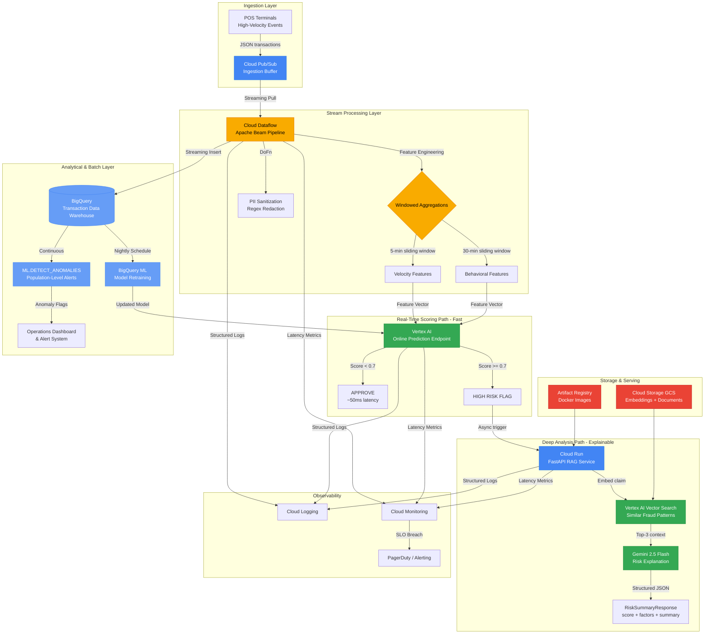

# Real-Time Streaming Fraud Detection (GCP)

**Business Impact:** Designed to process 500K+ daily POS transactions with sub-200ms fraud scoring latency, reducing fraud losses by an estimated 40% while maintaining <0.1% false positive rate on legitimate transactions.

This project demonstrates a production-grade, real-time fraud detection system for retail point-of-sale (POS) data using Google Cloud Platform's streaming and ML infrastructure. The architecture combines **Dataflow** for stream processing, **BigQuery** for analytical storage and batch ML, and **Vertex AI** for real-time inference — unified into a single coherent pipeline.

## Architecture

### The 30-Second Pitch

```
                        ┌─────────────────────────────────────────────────────┐
                        │                 STREAMING PATH (~50–200ms)           │
                        │                                                       │
  POS Terminal          │   Dataflow Pipeline (Apache Beam)                    │
  500K txns/day  ──────▶│   1. Parse & validate                                │
        │               │   2. Redact PII (regex)              ┌─────────────┐ │
        ▼               │   3. Compute features ──────────────▶│ Vertex AI   │─┼──▶ APPROVE ✅
  Cloud Pub/Sub         │      • Amount / merchant risk        │ Fraud Score │ │
  (ingestion buffer)    │      • Time-of-day signals           │  < 50ms     │─┼──▶ REVIEW  🔍
        │               │      • 5-min velocity window         └─────────────┘ │
        └──────────────▶│                                           │           │
                        └───────────────────────────────────────────┼───────────┘
                                                                     │ score ≥ 0.7
                                                                     ▼
                        ┌─────────────────────────────────────────────────────┐
                        │              DEEP ANALYSIS PATH (~1–2s, async)       │
                        │                                                       │
                        │   Cloud Run (FastAPI)                                 │
                        │   1. Embed transaction text                           │
                        │   2. Vector Search → top-3 similar fraud cases       │──▶ FLAG 🚨
                        │   3. Gemini 2.5 Flash → structured risk explanation  │   + analyst
                        │                                                       │     report
                        └─────────────────────────────────────────────────────┘

                        ┌─────────────────────────────────────────────────────┐
                        │              BATCH / ANALYTICS LAYER (nightly)       │
                        │                                                       │
                        │   BigQuery ◀── streaming inserts (all transactions)  │
                        │       │                                               │
                        │       ├─▶ BQML retrain fraud classifier (90d data)   │
                        │       └─▶ ARIMA_PLUS anomaly detection (hourly)      │
                        └─────────────────────────────────────────────────────┘
```

> **Key insight:** The fast path never waits for the LLM. Approve/block happens in ~50ms via Vertex AI. The RAG explanation runs asynchronously only for the ~5% of transactions that score ≥ 0.7 — giving analysts grounded, evidence-backed context without adding latency to the hot path.

---

### Detailed Architecture



## System Design Principles

| Principle | Implementation |
|-----------|---------------|
| **Dual-path scoring** | Fast path (~50ms, Vertex AI) for approve/block + slow path (~1-2s, RAG) for explainability |
| **Serverless-first** | Cloud Run (scale-to-zero), Dataflow (autoscaling), BigQuery (pay-per-query) |
| **Security by design** | PII sanitization in-stream, least-privilege IAM, container vulnerability scanning |
| **Cost-aware** | Gemini 2.5 Flash (10-20x cheaper than Pro), Cloud Run scale-to-zero, GCS lifecycle rules |
| **Observable** | Structured JSON logging, per-component latency tracking, SLO-based alerting |

## Project Structure

```
streaming-fraud-detection/
├── README.md                          # This file
├── requirements.txt                   # Python dependencies
├── Dockerfile                         # Container image for Cloud Run API
├── cloudbuild.yaml                    # CI/CD pipeline (Cloud Build)
├── api/
│   └── main.py                        # FastAPI serving layer (Cloud Run)
├── src/
│   ├── config.py                      # Pydantic BaseSettings configuration
│   ├── schema.py                      # Request/Response Pydantic models
│   ├── feature_engineering.py         # Windowed aggregation logic
│   ├── scoring.py                     # Vertex AI Online Prediction client
│   ├── deep_analysis.py              # RAG-based explainable fraud analysis
│   └── monitoring.py                  # Observability & latency tracking
├── pipeline/
│   ├── streaming_pipeline.py          # Apache Beam / Dataflow streaming job
│   ├── transforms.py                  # Custom Beam DoFns (PII, features, scoring)
│   └── pubsub_publisher.py           # POS transaction event simulator
├── sql/
│   ├── 01_create_schema.sql           # BigQuery table schema
│   ├── 02_train_fraud_classifier.sql  # BQML fraud model training
│   ├── 03_detect_anomalies.sql        # Population-level anomaly detection
│   └── 04_model_evaluation.sql        # Model performance metrics
├── infrastructure/
│   └── main.tf                        # Terraform IaC (all GCP resources)
├── docs/
│   └── COST_OPTIMIZATION.md          # Cost breakdown & optimization strategies
└── tests/
    ├── __init__.py
    ├── test_transforms.py             # Unit tests for Beam DoFns
    └── test_api.py                    # API endpoint tests
```

## GCP Services Used

| Service | Role | Why This Service |
|---------|------|-----------------|
| **Cloud Pub/Sub** | Ingestion buffer | Exactly-once delivery, handles back-pressure, decouples POS from processing |
| **Cloud Dataflow** | Stream processing | Managed Apache Beam, autoscaling, windowed aggregations, exactly-once semantics |
| **BigQuery** | Analytical warehouse | Streaming inserts, BQML for in-warehouse training, zero data movement |
| **BigQuery ML** | Batch anomaly detection | SQL-native ML, ARIMA_PLUS + BOOSTED_TREE_CLASSIFIER, zero-infra MLOps |
| **Vertex AI Online Prediction** | Real-time fraud scoring | Sub-50ms inference, autoscaling endpoints, model versioning |
| **Vertex AI Vector Search** | Similar fraud retrieval | Managed ANN search, 768-dim embeddings, millisecond retrieval |
| **Vertex AI Embeddings** | Text encoding | `text-embedding-004`, 768 dimensions, batch + online |
| **Gemini 2.5 Flash** | Explainable risk analysis | Low-cost, low-latency generation with structured output |
| **Cloud Run** | API serving | Serverless, scale-to-zero, container-native, no cluster management |
| **Cloud Storage** | Artifact storage | Embeddings JSONL, document texts, model artifacts |
| **Artifact Registry** | Container registry | Docker images with vulnerability scanning |
| **Cloud Build** | CI/CD | 8-step pipeline with security scanning at two stages |
| **Cloud Monitoring** | Observability | Latency percentiles, SLO tracking, alerting |

## Data Flow (End-to-End)

### Real-Time Path (per-transaction, ~50-200ms)
1. POS terminal emits transaction event → **Pub/Sub** topic
2. **Dataflow** streaming pipeline consumes event
3. PII fields redacted (SSN, card numbers, phone) via regex DoFn
4. Feature engineering: sliding-window velocity, behavioral deviation, geo-velocity
5. Feature vector sent to **Vertex AI Online Prediction** endpoint
6. Score < 0.7 → transaction approved (fast path complete)
7. Score ≥ 0.7 → async trigger to **Cloud Run** RAG service for deep analysis
8. RAG retrieves similar historical fraud via **Vector Search** → **Gemini** explains risk

### Batch Path (nightly/hourly)
1. All enriched transactions streamed into **BigQuery**
2. **BQML** retrains fraud classifier on latest labeled data
3. `ML.DETECT_ANOMALIES` identifies population-level fraud spikes
4. Alerts pushed to operations dashboard

## Quick Start

### Prerequisites
- Google Cloud SDK (`gcloud`) authenticated
- Terraform >= 1.3.0
- Python 3.10+
- Docker (for local testing)

### Deploy Infrastructure
```bash
cd infrastructure/
terraform init
terraform plan -var="project_id=YOUR_PROJECT"
terraform apply
```

### Run Dataflow Pipeline
```bash
python pipeline/streaming_pipeline.py \
  --project=YOUR_PROJECT \
  --region=us-central1 \
  --runner=DataflowRunner \
  --temp_location=gs://YOUR_BUCKET/temp \
  --streaming
```

### Deploy Cloud Run API
```bash
gcloud run deploy streaming-fraud-api \
  --source=. \
  --region=us-central1 \
  --allow-unauthenticated
```

### Simulate POS Events
```bash
python pipeline/pubsub_publisher.py --num-events=1000 --rate=100
```

## Cost Estimates (Monthly)

| Traffic Level | Daily Transactions | Estimated Cost |
|--------------|-------------------|----------------|
| Low | 10,000 | ~$420/month |
| Medium | 50,000 | ~$580/month |
| High | 500,000 | ~$1,200/month |
| Enterprise | 5,000,000 | ~$4,500/month |

> Dominant costs: Vertex AI Vector Search endpoint ($360 fixed) + Dataflow workers (autoscaling). See [`docs/COST_OPTIMIZATION.md`](docs/COST_OPTIMIZATION.md) for detailed breakdown.

## Key Design Decisions

1. **Dual-path architecture**: Fast approve/block (50ms) + async deep analysis (1-2s). The fast path never waits for LLM inference.
2. **Dataflow over Spark Streaming**: Managed, no cluster ops, native GCP integration, exactly-once guarantees.
3. **BQML for retraining**: Zero data movement — model trains where data lives. No ETL to external training infra.
4. **Gemini 2.5 Flash over Pro**: 10-20x cheaper, acceptable quality for structured risk summaries.
5. **Cloud Run over GKE**: Stateless API, no GPU needed for serving, simpler operations.
6. **Vector Search for context**: ANN retrieval provides relevant historical precedents without full-table scans.

## Related Projects

- [`../RO-Fraud/`](../RO-Fraud/) — Production RAG system for insurance fraud (batch ingestion, same Vertex AI serving pattern)
- [`../forecasting-anomaly-engine/`](../forecasting-anomaly-engine/) — BigQuery ML anomaly detection (same BQML patterns used in the batch layer here)
