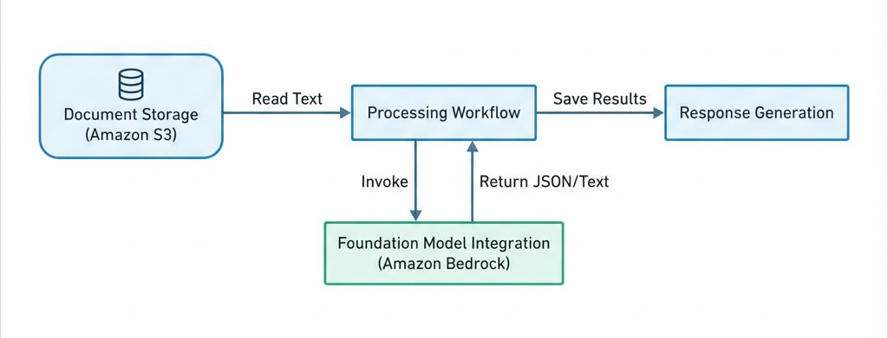

# Insurance Claims Processing POC

## Step 1. Design the architecture (Skill 1.1.1)

### Architecture Diagram

### Amazon Bedrock Model Selection

*   **Baseline Model:** `anthropic.claude-3-sonnet-20240229-v1:0`
    *   *Role:* Document understanding, complex reasoning, and high-quality summarization.
    *   *Reasoning:* High capability for analyzing context within unstructured text and producing professional summaries.
*   **Challenger Model:** `amazon.nova-micro-v1:0`
    *   *Role:* High-speed information extraction and cost-effective processing.
    *   *Reasoning:* Extremely low latency and cost, suitable for high-volume structured data extraction tasks.

## Step 2. Implement proof-of-Concept (Skill 1.1.2)

### AWS Environment Setup

# Create S3 bucket (if not exists)
aws s3 mb s3://cert-genai-dev

### Synthetic Data Generation

To test the system with varied data, a synthetic data generator (`synthetic-text-generator.ipynb`) is used:

1.  **Data Creation:** Uses the `Faker` library to generate realistic claim details (names, policy numbers, dates, amounts).
2.  **Scenario Generation:** Randomly selects damage scenarios (e.g., "rear-ended", "hail damage") to create context-aware descriptions.
3.  **File Formatting:** Formats the data into a plain text "Insurance Claim Submission Form" structure.
4.  **S3 Upload:** Automatically uploads the generated text files to the S3 bucket (`s3://cert-genai-dev/bonus_1.1/`) for processing.

### Python Application Components

The application is implemented in `poc-claims-v3.ipynb` and consists of:

1.  **Document Retrieval:**
    *   Connects to S3 using `boto3`.
    *   Lists and reads text files from the `bonus_1.1/` prefix.

2.  **Amazon Bedrock Integration:**
    *   Uses `boto3` bedrock-runtime client.
    *   Supports dynamic model selection (Anthropic Claude 3 & Amazon Nova).
    *   Handles different request/response schemas for different model providers.

3.  **Simple RAG Component:**
    *   The current version (v3) focuses on direct extraction and summarization of the claim data itself without external policy context retrieval.

4.  **Claim Summary Generation:**
    *   Generates a structured summary including Claim Overview, Incident Details, Financial Impact, and Recommended Next Steps.

## Step 3. Create reusable components (Skill 1.1.3)

The solution modularizes functionality into the following reusable components:

### 1. Prompt Template Manager (`PromptTemplateManager`)
A class that centralizes prompt management, allowing for easy updates and variable injection.
*   **Templates:**
    *   `extract_info`: Instructions for extracting structured JSON data (Claimant, Policy #, Date, Amount, Description).
    *   `generate_summary`: Instructions for generating a professional summary from the extracted JSON.

### 2. Model Invoker (`invoke_bedrock_model`)
A wrapper function for the Bedrock API that handles:
*   Dynamic payload construction based on model provider (Anthropic vs. Amazon Nova).
*   Model ID specification.
*   Response parsing logic for different model outputs.
*   Error handling.

### 3. Workflow Orchestrator (`process_claim_with_model`)
A function that manages the end-to-end lifecycle of a single claim for a specific model:
1.  Retrieves text from S3.
2.  Calls `extract_claim_info` (measures latency).
3.  Calls `generate_claim_summary` (measures latency).
4.  Saves outputs (Markdown summary & JSON result) to local disk.
5.  Returns performance metrics.

## Step 4. Test and evaluate

### Testing Methodology
The system was tested using a comparative batch processing approach:
1.  `list_s3_files()` retrieves all available `.txt` claim files.
2.  The workflow iterates through each file for **both** models (Claude 3 Sonnet and Amazon Nova Micro).
3.  Results are aggregated and saved to `model_comparison_results.json`.
4.  Performance metrics (Total Time, Extraction Time, Summary Time) are calculated and compared.

### Findings
*   **Speed:** Amazon Nova Micro reduced total processing time by approximately **45%** compared to Claude 3 Sonnet.
*   **Extraction Efficiency:** For the structured extraction task, Nova Micro was **2.5x faster** (avg ~0.49s vs ~1.21s) while maintaining valid JSON output.
*   **Summarization:** Nova Micro generated summaries significantly faster (~1.7s vs ~5.1s), though Sonnet's summaries tended to be more verbose and linguistically nuanced.
*   **Recommendation:** Switch to **Amazon Nova Micro** for the primary extraction and summarization pipeline to optimize for speed and cost, while retaining Claude 3 Sonnet for complex edge cases requiring deeper reasoning.

