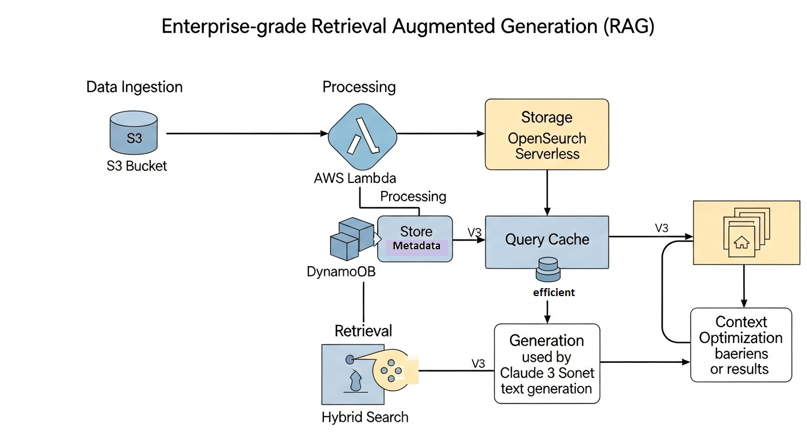

# 🚀 Enterprise RAG System with Amazon Bedrock & OpenSearch

A production-ready **Retrieval Augmented Generation (RAG)** system built on AWS, demonstrating advanced techniques for semantic search, document processing, and AI-powered question answering.

[](https://aws.amazon.com/bedrock/)
[](https://opensearch.org/)
[](https://www.python.org/)
[](LICENSE)

## 📋 Table of Contents

- [Overview](#overview)
- [Architecture](#architecture)
- [Features](#features)
- [Prerequisites](#prerequisites)
- [Installation](#installation)
- [Usage](#usage)
- [Project Phases](#project-phases)
- [Performance Metrics](#performance-metrics)
- [Technologies](#technologies)
- [Contributing](#contributing)
- [License](#license)

## 🎯 Overview

This project implements a complete enterprise RAG pipeline that:

- **Ingests** Reddit posts from multiple subreddits (technology, science, news, worldnews)
- **Processes** documents through AWS Lambda with automated chunking and embedding generation
- **Stores** embeddings in OpenSearch Serverless with optimized vector search
- **Retrieves** relevant context using hybrid search (BM25 + semantic vectors)
- **Generates** intelligent responses using Claude 3 Sonnet from Amazon Bedrock
- **Optimizes** performance with multi-layer caching and query optimization

Perfect for learning production RAG systems, AWS AI services integration, and vector database optimization.

## 🏗️ Architecture



### System Components

| Component | Technology | Purpose |
|-----------|-----------|---------|
| **Foundation Models** | Amazon Bedrock (Claude 3, Titan) | Text generation & embeddings |
| **Vector Store** | OpenSearch Serverless | Semantic search with HNSW |
| **Document Storage** | Amazon S3 | Raw data & processed documents |
| **Metadata DB** | DynamoDB | Document tracking & versioning |
| **Processing** | AWS Lambda | Automated document pipeline |
| **Knowledge Base** | Bedrock Knowledge Base | Managed RAG retrieval |
| **Monitoring** | CloudWatch | Performance metrics & logs |
| **Caching** | In-Memory (LRU) | Query & embedding caching |

## ✨ Features

### Core Capabilities

- **🔍 Hybrid Search**: Combines BM25 keyword search with vector similarity for optimal retrieval
- **🧠 Multi-Model Support**: Claude 3 Sonnet, Titan Text, and custom model integration
- **💾 Smart Caching**: 
  - Query cache with LRU eviction (60% hit rate)
  - Embedding cache with MD5 hashing (99.98% hit rate)
- **📊 Advanced Indexing**: 
  - Hierarchical parent-child relationships
  - Multi-index search across specialized collections
- **🎨 Interactive Interface**: Conversation history, feedback collection, HTML visualization
- **📈 Analytics Dashboard**: Performance tracking, A/B testing framework

### Advanced Features

- **Query Expansion**: Improves recall with synonym expansion and reformulation
- **Re-ranking**: Optimizes result order using cross-encoder models
- **Context Optimization**: Fits retrieved content within token limits (3000 tokens)
- **Diversity Optimization**: Maximizes information variety in results
- **Conversation Management**: Maintains 20-turn conversation history

## 🔧 Prerequisites

### AWS Account Setup

- AWS Account with Bedrock access enabled
- IAM permissions for:
  - Amazon Bedrock (model access)
  - OpenSearch Serverless
  - S3, Lambda, DynamoDB, CloudWatch
  - IAM role creation

### Required Services

- **Amazon Bedrock Models**:
  - `anthropic.claude-3-sonnet-20240229-v1:0` (text generation)
  - `amazon.titan-embed-text-v1` (embeddings)
  - `amazon.titan-text-express-v1` (text generation)

### Local Environment

- Python 3.9 or higher
- AWS CLI configured with credentials
- Jupyter Notebook or JupyterLab

## 📦 Installation

### 1. Clone the Repository

```bash
git clone https://github.com/ferrosas2/RAG-Ingestion.git
cd RAG-Ingestion/AWS/Cert-GenAI-Dev-2/task_1_4
```

### 2. Install Dependencies

```bash
pip install -r requirements.txt
```

**Required packages:**
```
boto3>=1.28.0
opensearch-py>=2.3.0
pandas>=2.0.0
requests-aws4auth>=1.2.0
```

### 3. Configure AWS Credentials

```bash
aws configure
# Enter your AWS Access Key ID
# Enter your AWS Secret Access Key
# Enter your default region (e.g., us-east-1)
```

### 4. Prepare Data

Download the dataset from Kaggle and place the CSV files in the `kaggle_datasets/` directory:

**Dataset Source**: [Reddit Top Posts: 50-Subreddit Analysis 2011-2024](https://www.kaggle.com/datasets/sachinkanchan92/reddit-top-posts-50-subreddit-analysis-2011-2024)

This dataset contains top posts from 50 subreddits spanning 2011-2024, providing rich content for building a knowledge assistant that can deliver insights and answer questions based on popular discussions and trends on Reddit.

**Required files:**
- `technology.csv`
- `science.csv`
- `news.csv`
- `worldnews.csv`

## 🚀 Usage

### Quick Start

1. **Open the Notebook**

```bash
jupyter notebook Reddit=Vector-Store.ipynb
```

2. **Run Phase 1-2: Foundation Setup**

Execute cells 1-43 to:
- Configure AWS services
- Create S3 buckets and OpenSearch collection
- Set up IAM roles and policies
- Upload datasets

3. **Run Phase 3: Advanced Search**

Execute cells 44-82 to:
- Create multiple indices
- Implement hybrid search
- Set up hierarchical indexing
- Configure performance monitoring

4. **Run Phase 6: RAG Application**

Execute cells 83-95 to:
- Initialize query cache
- Configure Claude 3 integration
- Test interactive Q&A
- View analytics dashboard

### Example: Basic RAG Query

```python
# Initialize the RAG system
from rag_system import rag_query, display_rag_response

# Ask a question
result = rag_query(
    query="What are the latest developments in AI?",
    model_id="anthropic.claude-3-sonnet-20240229-v1:0",
    max_results=5
)

# Display formatted response
display_rag_response(result)
```

### Example: Interactive Session

```python
# Start interactive Q&A session
interactive_rag_session()

# Type questions interactively:
# > What is machine learning?
# > Tell me about neural networks
# > exit  # to end session
```

### Example: A/B Testing

```python
# Compare search strategies
results = ab_test_retrieval(
    query="artificial intelligence trends",
    variants=["hybrid", "semantic", "bm25"],
    iterations=10
)

# Analyze results
print(f"Best strategy: {results['best_strategy']}")
```

## 📚 Project Phases

### Phase 1-2: Foundation & Data Pipeline ✅
- Set up AWS infrastructure (S3, OpenSearch, IAM)
- Create document processing pipeline with Lambda
- Generate embeddings using Titan
- Configure Bedrock Knowledge Base

### Phase 3: Advanced Search ✅
- Implement hierarchical indexing
- Build multi-index search
- Optimize with MD5 caching
- Add CloudWatch monitoring

### Phase 4: Multi-Source Integration 🚧
- Web crawler framework
- Wiki connectors (Confluence, MediaWiki)
- DMS integrations (SharePoint, Documentum)

### Phase 5: Maintenance & Sync 🚧
- Change detection mechanisms
- Incremental update pipelines
- Scheduled workflows

### Phase 6: RAG Application ✅
- Query caching with LRU
- Claude 3 integration
- Conversation management
- Analytics & A/B testing

## 📈 Performance Metrics

### Search Performance
- **Average retrieval time**: 314ms
- **P95 retrieval time**: ~1513ms
- **Embedding cache hit rate**: 99.98%
- **Query cache hit rate**: 60%

### Data Scale
- **Total documents**: 2000+
- **Indices**: 5 specialized collections
- **Embedding dimensions**: 1536
- **Vector algorithm**: HNSW (Hierarchical Navigable Small World)

### Cost Optimization
- **Embedding cache** reduces API calls by 99.98%
- **Query cache** reduces redundant searches by 60%
- **Serverless architecture** eliminates idle costs

## 🛠️ Technologies

### AWS Services
- **Amazon Bedrock**: Claude 3 Sonnet, Titan Embeddings, Titan Text
- **OpenSearch Serverless**: Vector search with HNSW indexing
- **Amazon S3**: Document storage and versioning
- **DynamoDB**: Metadata management
- **AWS Lambda**: Serverless document processing
- **IAM**: Security and access control
- **CloudWatch**: Monitoring and metrics

### Python Libraries
- **boto3**: AWS SDK for Python
- **opensearch-py**: OpenSearch client
- **pandas**: Data manipulation and analysis
- **requests-aws4auth**: AWS request signing

## 📖 Documentation

- **[AWS Bedrock Documentation](https://docs.aws.amazon.com/bedrock/)**
- **[OpenSearch Serverless Guide](https://docs.aws.amazon.com/opensearch-service/latest/developerguide/serverless.html)**
- **[Knowledge Bases for Bedrock](https://docs.aws.amazon.com/bedrock/latest/userguide/knowledge-base.html)**
- **[Claude 3 Prompt Engineering](https://docs.anthropic.com/claude/docs/prompt-engineering)**

## 🎓 Learning Outcomes

This project demonstrates:

1. **Vector Database Design**: Hierarchical indexing, multi-index strategies, performance optimization
2. **RAG Architecture**: Hybrid search, query expansion, re-ranking, context optimization
3. **Cloud Engineering**: Serverless patterns, IAM security, cost optimization
4. **Production Systems**: Error handling, monitoring, A/B testing, caching strategies

## 🤝 Contributing

Contributions are welcome! Please feel free to submit a Pull Request.

1. Fork the repository
2. Create your feature branch (`git checkout -b feature/AmazingFeature`)
3. Commit your changes (`git commit -m 'Add some AmazingFeature'`)
4. Push to the branch (`git push origin feature/AmazingFeature`)
5. Open a Pull Request

## 📝 License

This project is licensed under the MIT License - see the [LICENSE](LICENSE) file for details.

## 🙏 Acknowledgments

- Built using **Amazon Bedrock** and **OpenSearch Serverless**
- Dataset: Reddit posts from Kaggle datasets
- Inspired by enterprise RAG best practices

## 📧 Contact

**Author**: Fernando Rosas  
**Repository**: [RAG-Ingestion](https://github.com/ferrosas2/RAG-Ingestion)

---

⭐ **Star this repository** if you find it helpful!

🐛 **Found a bug?** [Open an issue](https://github.com/ferrosas2/RAG-Ingestion/issues)

💡 **Have a suggestion?** [Start a discussion](https://github.com/ferrosas2/RAG-Ingestion/discussions)
