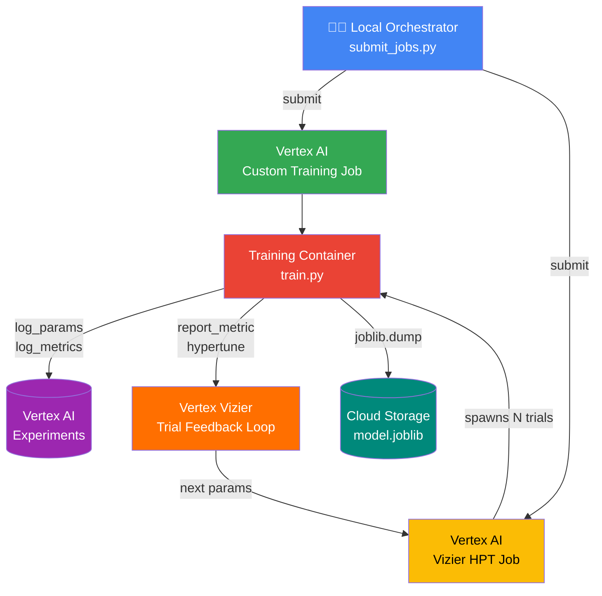

# vertex-classic-ml — Classic ML Orchestration on Vertex AI

## Executive Summary

This repository demonstrates a **production-grade MLOps pattern** for training
and tuning classic Machine Learning models on Google Cloud using the
**Vertex AI SDK** (`google-cloud-aiplatform`).

The architecture enforces a clean separation of concerns:

| Layer | Where it runs | What it does |
|---|---|---|
| **Orchestration** (`submit_jobs.py`) | Local laptop / Airflow / CI | Configures and submits GCP jobs |
| **Execution** (`train.py`) | Vertex AI managed compute | Trains the model, logs to Experiments |
| **Storage** | Cloud Storage (GCS) | Persists serialised model artefacts |
| **Tracking** | Vertex AI Experiments | Records params, metrics, lineage |
| **Tuning** | Vertex AI Vizier (HPT) | Bayesian hyperparameter optimisation |

No training compute runs locally. The developer machine (or Airflow worker)
only needs the Vertex AI SDK and valid GCP credentials.

---

## MLOps Flow



**Key architectural insight:** The orchestration layer (`submit_jobs.py`) is
completely decoupled from the execution layer (`train.py`).  Swapping the
orchestrator from a local script to an Airflow DAG, a GitHub Actions workflow,
or a Cloud Run job requires zero changes to the training code.

---

## Repository Structure

```
vertex-classic-ml/
├── requirements.txt          # Python dependencies
├── README.md
└── src/
    ├── train.py              # Training container script (runs on Vertex AI)
    └── submit_jobs.py        # Local orchestrator (runs on your machine)
```

---

## Prerequisites

| Requirement | Notes |
|---|---|
| Python 3.10+ | Matches Vertex AI pre-built container base |
| `gcloud` CLI | Authenticated (`gcloud auth application-default login`) |
| GCP project with Vertex AI API enabled | `gcloud services enable aiplatform.googleapis.com` |
| GCS bucket | Used for staging and model artefacts |
| IAM roles | `roles/aiplatform.user`, `roles/storage.objectAdmin` |

---

## Quick Start

### 1. Install dependencies

```bash
pip install -r requirements.txt
```

### 2. Set environment variables

```bash
export PROJECT_ID="your-gcp-project-id"
export REGION="us-central1"
export BUCKET_NAME="your-gcs-bucket-name"

# Optional overrides
export SERVICE_ACCOUNT="your-sa@your-project.iam.gserviceaccount.com"
```

### 3a. Submit a Custom Training Job

```bash
python src/submit_jobs.py --job-type training
```

### 3b. Submit a Hyperparameter Tuning Job (Vertex Vizier)

```bash
python src/submit_jobs.py --job-type hpt
```

### 3c. Submit both sequentially

```bash
python src/submit_jobs.py --job-type all
```

### 4. Local smoke-test (no GCP required)

Run `train.py` locally to validate the training logic without GCP credentials.
The Vertex AI SDK calls will fail gracefully if no project is configured — you
can comment out the `aiplatform.*` calls for a pure local test.

```bash
python src/train.py \
    --max_depth 4 \
    --learning_rate 0.1 \
    --n_estimators 100 \
    --subsample 0.8 \
    --model_dir /tmp/credit-risk-model
```

---

## Key Design Decisions

### `cloudml-hypertune` integration
`train.py` uses `hypertune.HyperTune().report_hyperparameter_tuning_metric()`
to report `f1_score` back to Vertex Vizier after each trial.  This is the
**only required change** to make a standard training script compatible with
HPT — no SDK-specific training loop is needed.

### Vertex AI Experiments
Every run (whether a standalone job or an HPT trial) initialises
`aiplatform.init(experiment='credit-risk-experiment')` and calls
`aiplatform.log_params` / `aiplatform.log_metrics`.  This gives full
lineage — every hyperparameter combination is traceable to its metric outcome
in the Vertex AI Experiments console.

### Pre-built training containers
`submit_jobs.py` uses Google-managed pre-built containers rather than a
custom Docker image.  This avoids image build/push overhead during development
while keeping the container surface minimal and patched by Google.

### Synthetic dataset
`train.py` generates data via `sklearn.datasets.make_classification`, making
the entire repository self-contained and runnable without any external data
source.  Swap `build_dataset()` for your real feature pipeline in production.

---

## Extending to Production

- **Custom container image**: Replace `script_path` + `requirements` with a
  `container_uri` pointing to your Artifact Registry image for faster cold
  starts and reproducible environments.
- **GPU training**: Change `machine_type` to `n1-standard-8` and add
  `accelerator_type="NVIDIA_TESLA_T4"` in the worker pool spec.
- **Model Registry**: After training, call
  `aiplatform.Model.upload()` to register the artefact in Vertex AI Model
  Registry for versioning and online serving.
- **Airflow DAG**: Wrap `submit_custom_training_job()` and `submit_hpt_job()`
  in `@task` decorated functions inside an Airflow DAG for fully managed
  scheduling and retry logic.
