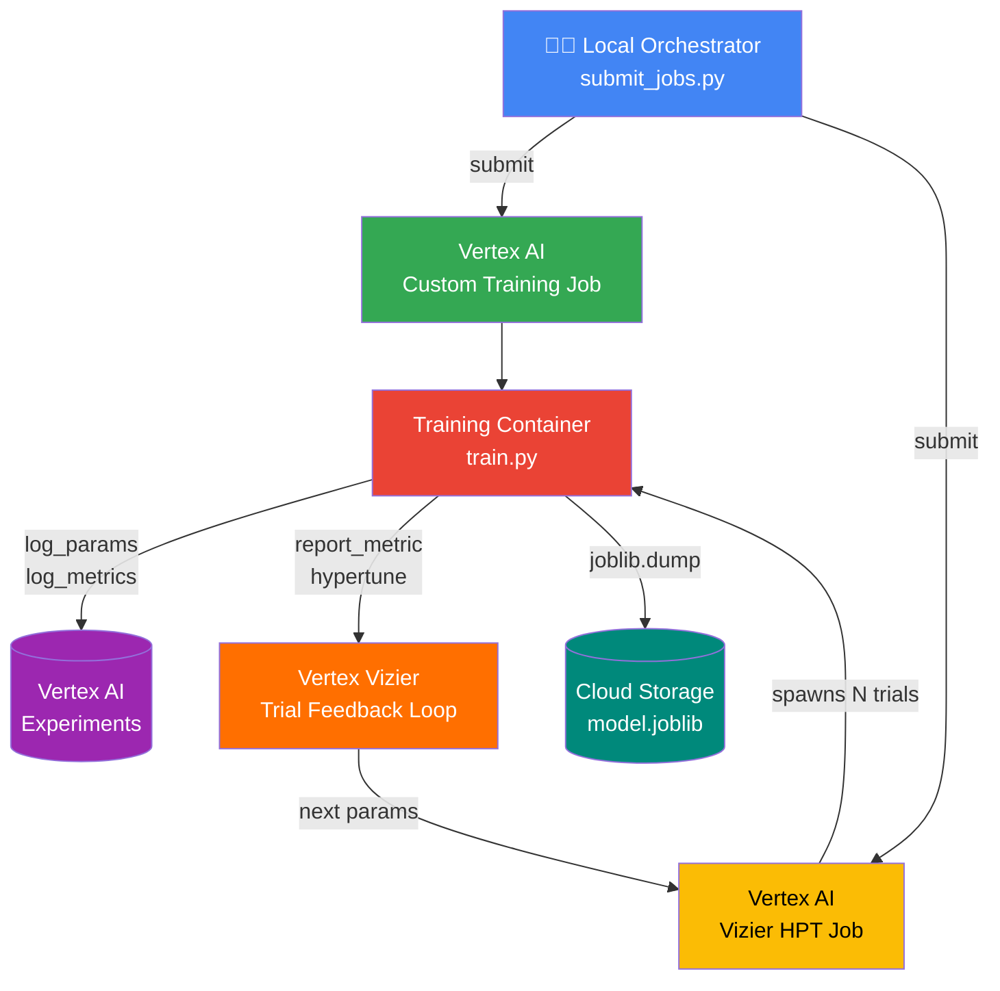

# vertex-classic-ml — Classic ML Orchestration on Vertex AI

## Executive Summary

This repository demonstrates a **production-grade MLOps pattern** for training
and tuning classic Machine Learning models on Google Cloud using the
**Vertex AI SDK** (`google-cloud-aiplatform`).

The architecture enforces a clean separation of concerns:

| Layer | Where it runs | What it does |
|---|---|---|
| **Orchestration** (`submit_jobs.py`) | Local laptop / Airflow / CI | Configures and submits GCP jobs |
| **Execution** (`train.py`) | Vertex AI managed compute | Trains the model, logs to Experiments |
| **Storage** | Cloud Storage (GCS) | Persists serialised model artefacts |
| **Tracking** | Vertex AI Experiments | Records params, metrics, lineage |
| **Tuning** | Vertex AI Vizier (HPT) | Bayesian hyperparameter optimisation |

No training compute runs locally. The developer machine (or Airflow worker)
only needs the Vertex AI SDK and valid GCP credentials.

---

## Verified Execution Results

This pipeline has been tested end-to-end on Vertex AI (June 2026):

| Job Type | Resource ID | Status |
|---|---|---|
| Custom Training Job | `projects/43641279799/locations/us-central1/trainingPipelines/4061936234673471488` | ✅ Completed |
| Hyperparameter Tuning (Vizier) | `projects/43641279799/locations/us-central1/hyperparameterTuningJobs/601254172574089216` | ✅ Completed (6 trials) |

**Artefacts produced:**
- `gs://credit_risk_training/models/credit-risk/training/model.joblib` — single-run model
- `gs://credit_risk_training/models/credit-risk/hpt/model.joblib` — best HPT trial model
- Vertex AI Experiments: params + metrics logged per run under experiment `credit-risk-experiment`

---

## MLOps Flow



**Key architectural insight:** The orchestration layer (`submit_jobs.py`) is
completely decoupled from the execution layer (`train.py`).  Swapping the
orchestrator from a local script to an Airflow DAG, a GitHub Actions workflow,
or a Cloud Run job requires zero changes to the training code.

---

## Repository Structure

```
vertex-classic-ml/
├── requirements.txt          # Pinned Python dependencies
├── README.md
└── src/
    ├── train.py              # Training container script (runs on Vertex AI)
    └── submit_jobs.py        # Local orchestrator (runs on your machine)
```

---

## GCP Services Used

| Service | Purpose | SDK Method |
|---|---|---|
| **Vertex AI Custom Training** | Serverless model training on managed compute | `aiplatform.CustomTrainingJob` |
| **Vertex AI Experiments** | Experiment tracking (params, metrics, lineage) | `aiplatform.log_params()` / `aiplatform.log_metrics()` |
| **Vertex AI Vizier (HPT)** | Bayesian hyperparameter optimisation across trials | `aiplatform.HyperparameterTuningJob` |
| **Cloud Storage (GCS)** | Model artefact persistence and staging | `google.cloud.storage` |
| **cloudml-hypertune** | Report trial metrics back to Vizier | `hypertune.HyperTune().report_hyperparameter_tuning_metric()` |

---

## Prerequisites

| Requirement | Notes |
|---|---|
| Python 3.10+ | Matches Vertex AI pre-built container base |
| `gcloud` CLI | Authenticated (`gcloud auth application-default login`) |
| GCP project with Vertex AI API enabled | `gcloud services enable aiplatform.googleapis.com` |
| GCS bucket | Used for staging and model artefacts |
| IAM roles | `roles/aiplatform.user`, `roles/storage.objectAdmin` |

---

## Quick Start

### 1. Create a conda environment

```bash
conda create -n credit-risk python=3.10 -y
conda activate credit-risk
pip install -r requirements.txt
```

### 2. Set environment variables

**PowerShell (Windows):**
```powershell
$env:PROJECT_ID = "your-gcp-project-id"
$env:REGION = "us-central1"
$env:BUCKET_NAME = "your-gcs-bucket-name"

# Optional overrides
$env:SERVICE_ACCOUNT = "your-sa@your-project.iam.gserviceaccount.com"
$env:TRAIN_IMAGE = "us-docker.pkg.dev/vertex-ai/training/sklearn-cpu.1-0:latest"
```

**Bash (Linux/macOS):**
```bash
export PROJECT_ID="your-gcp-project-id"
export REGION="us-central1"
export BUCKET_NAME="your-gcs-bucket-name"

# Optional overrides
export SERVICE_ACCOUNT="your-sa@your-project.iam.gserviceaccount.com"
export TRAIN_IMAGE="us-docker.pkg.dev/vertex-ai/training/sklearn-cpu.1-0:latest"
```

### 3. Authenticate with GCP

```bash
gcloud auth application-default login --project=your-gcp-project-id
```

### 4a. Submit a Custom Training Job

```bash
python src/submit_jobs.py --job-type training
```

### 4b. Submit a Hyperparameter Tuning Job (Vertex Vizier)

```bash
python src/submit_jobs.py --job-type hpt
```

### 4c. Submit both sequentially

```bash
python src/submit_jobs.py --job-type all
```

### 5. Fire-and-forget mode (non-blocking)

```bash
python src/submit_jobs.py --job-type training --no-sync
python src/submit_jobs.py --job-type hpt --no-sync
```

---

## Pre-built Container Images

The pipeline uses Google-managed pre-built training containers. Supported options:

| Framework | Image URI | Python |
|---|---|---|
| **scikit-learn 1.0** (default) | `us-docker.pkg.dev/vertex-ai/training/sklearn-cpu.1-0:latest` | 3.10 |
| **scikit-learn 1.6** | `us-docker.pkg.dev/vertex-ai/training/sklearn-cpu.1-6:latest` | 3.10 |
| **XGBoost 2.1** | `us-docker.pkg.dev/vertex-ai/training/xgboost-cpu.2-1:latest` | 3.10 |
| **XGBoost 1.6** | `us-docker.pkg.dev/vertex-ai/training/xgboost-cpu.1-6:latest` | 3.10 |

Override via `$env:TRAIN_IMAGE` / `export TRAIN_IMAGE=...` to use a different container.

Full list: https://cloud.google.com/vertex-ai/docs/training/pre-built-containers

---

## Hyperparameter Search Space (Vizier)

| Parameter | Type | Range | Scale |
|---|---|---|---|
| `learning_rate` | Double | 0.01 – 0.3 | Log |
| `max_depth` | Integer | 2 – 8 | Linear |
| `n_estimators` | Integer | 50 – 300 | Linear |
| `subsample` | Double | 0.5 – 1.0 | Linear |
| `colsample_bytree` | Double | 0.5 – 1.0 | Linear |

- **Algorithm**: Vertex Vizier default (Bayesian optimisation)
- **Metric**: `f1_score` (maximize)
- **Trials**: 6 (configurable via `MAX_TRIAL_COUNT` in `submit_jobs.py`)
- **Parallel**: 3 (configurable via `PARALLEL_TRIAL_COUNT`)

---

## Key Design Decisions

### Separation of Orchestration and Execution
`submit_jobs.py` runs on your laptop or CI/CD system — it only configures and
submits jobs. `train.py` runs inside Vertex AI managed compute. This separation
means swapping from a local script to Airflow, Cloud Composer, or GitHub Actions
requires zero changes to the training logic.

### `cloudml-hypertune` integration
`train.py` uses `hypertune.HyperTune().report_hyperparameter_tuning_metric()`
to report `f1_score` back to Vertex Vizier after each trial.  This is the
**only required change** to make a standard training script compatible with
HPT — no SDK-specific training loop is needed.

### Vertex AI Experiments
Every run (whether a standalone job or an HPT trial) initialises
`aiplatform.init(experiment='credit-risk-experiment')` and calls
`aiplatform.log_params` / `aiplatform.log_metrics`.  This gives full
lineage — every hyperparameter combination is traceable to its metric outcome
in the Vertex AI Experiments console.

### Pre-built training containers
`submit_jobs.py` uses Google-managed pre-built containers rather than a
custom Docker image.  This avoids image build/push overhead during development
while keeping the container surface minimal and patched by Google.

### Synthetic dataset
`train.py` generates data via `sklearn.datasets.make_classification` (10,000
samples, 20 features, 70/30 class imbalance), making the entire repository
self-contained and runnable without any external data source.  Swap
`build_dataset()` for your real feature pipeline in production.

### Auto-generated experiment run names
Each run gets a unique name (`run-<uuid>`) ensuring no collisions when running
multiple jobs in parallel or re-running the pipeline.

---

## Extending to Production

| Enhancement | How |
|---|---|
| **Custom container image** | Replace `script_path` + `requirements` with a `container_uri` pointing to your Artifact Registry image |
| **GPU training** | Change `machine_type` to `n1-standard-8`, add `accelerator_type="NVIDIA_TESLA_T4"` |
| **Model Registry** | After training, call `aiplatform.Model.upload()` for versioning and serving |
| **Airflow / Cloud Composer** | Wrap `submit_custom_training_job()` and `submit_hpt_job()` in `@task` decorated functions |
| **CI/CD (GitHub Actions)** | Trigger `submit_jobs.py` on merge to main with secrets for GCP auth |
| **Feature Store** | Replace `build_dataset()` with `aiplatform.Featurestore` reads for production features |
| **Model Monitoring** | Deploy via Vertex AI Endpoints with skew/drift detection enabled |

---

## Cost Considerations

| Resource | Approximate Cost |
|---|---|
| `n1-standard-4` training (per hour) | ~$0.19/hr |
| Custom Training Job (single run, ~10 min) | ~$0.03 |
| HPT Job (6 trials, 3 parallel, ~30 min wall time) | ~$0.19 |
| GCS storage (model artefacts) | Negligible |

To minimise cost during development, use `--no-sync` and cancel jobs via the
console if they're taking too long. Adjust `MAX_TRIAL_COUNT` and
`PARALLEL_TRIAL_COUNT` in `submit_jobs.py` based on budget.

---

## Troubleshooting

| Error | Cause | Fix |
|---|---|---|
| `PERMISSION_DENIED: Permission denied on resource project` | Wrong project ID or unauthenticated | Run `gcloud auth application-default login`; verify `$env:PROJECT_ID` |
| `Image ... is not supported` | Invalid container URI format | Use `sklearn-cpu.1-0` (not `scikit-learn-cpu.1-0`). See container table above |
| `start_run() missing 1 required positional argument` | SDK requires explicit run name | Already fixed — uses UUID-based auto-naming |
| `Training did not produce a Managed Model` | Informational only — no `model_serving_container_image_uri` set | Expected behaviour; model is saved to GCS directly |
| `export is not recognized` (Windows) | Using bash syntax in PowerShell | Use `$env:VAR = "value"` instead of `export VAR=` |
